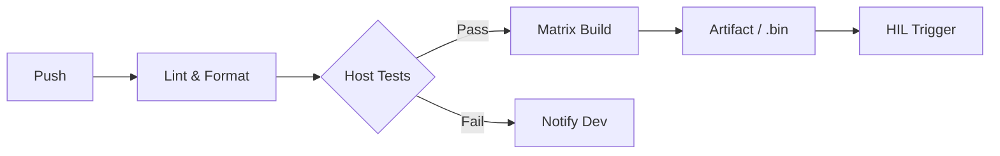

# Continuous Integration (CI)

> "A manual test is a one-time event. An automated test is a permanent asset that protects your sanity forever."

## The Hook: The "Merge and Pray" Era is Over
Traditionally, firmware teams practiced "Siloed Development." Each engineer worked on their own PCB for three weeks, then gathered in a room for an "Integration Week." This was a stressful seven days of hacky fixes, late nights, and broken boards.

**Continuous Integration (CI)** is the "Zero to One" shift that automates this integration every time you save a file. If you break the build, you know it in three minutes, not three weeks.

## The Theory: The Automated Gatekeeper
The "Secret" of CI is the **Pipeline**.



---

## Case Study: Ford Motor Company - ADAS HIL Cloud (Success)
Ford faced a massive challenge: verifying the software for Advanced Driver Assistance Systems (ADAS) across dozens of vehicle variants.

*   **The Problem:** Hardware-in-the-Loop (HIL) rigs are expensive and finite. Scheduling tests manually created a massive bottleneck for their thousands of developers.
*   **The Solution:** They built a **Cloud-based HIL Architecture**. Using a microservice-based test execution engine, they treated their physical testing rigs like cloud resources. Developers could "request" a test run via a CI trigger, and the system would automatically schedule it on the next available rig.
*   **The Result:** Optimal utilization of costly equipment and a significant reduction in software verification time.
*   **The Lesson:** CI doesn't stop at the compiler. It orchestrates the entire physical verification world.

## Case Study: Particle IoT - 150,000 Devices (Success)
Particle, the IoT platform provider, uses GitHub Actions to manage firmware for a fleet of over 150,000 devices.

*   **The Win:** They use "Matrix Builds" to compile and test the same firmware against dozens of different hardware versions and connectivity stacks (Wi-Fi, Cellular, Bluetooth) simultaneously.
*   **The Result:** They can push security patches to thousands of diverse devices with the confidence that they haven't broken local compatibility for a single one.

### The Success of Automated Delivery (Positive Example)
The global service provider **ADP** revolutionized its software delivery by building a standardized, containerized CI/CD pipeline.

*   **The Problem:** Fragmented development environments and manual deployment steps created "environmental drift" and slowed down release cycles.
*   **The Strategy:** They implemented a "Golden Path" for development. Every code change triggered a standardized suite of automated builds and tests in an isolated, bit-identical environment.
*   **The Data:** ADP observed a **40% increase in developer productivity**. The time required to onboard new team members dropped significantly. Lead times for critical security updates moved from weeks to hours.
*   **The Lesson:** CI is a productivity engine. By automating the "Plumbing" of software development, you free your engineering talent to focus on unique business logic. A high-performance pipeline is the primary competitive advantage in any software-defined industry.

---

---

## The Implementation: The GitHub Actions Blueprint
A modern `.github/workflows/ci.yml` for firmware should look like this:

```yaml
name: Firmware CI
on: [push, pull_request]

jobs:
  build:
    runs-on: ubuntu-latest
    steps:
      - uses: actions/checkout@v4
      - name: Build in Docker
        run: docker run --rm -v $(pwd):/work my-firmware-build-env make
      - name: Run Unit Tests
        run: docker run --rm -v $(pwd):/work my-firmware-build-env ./run_tests.sh
      - name: Upload Binary
        uses: actions/upload-artifact@v4
        with:
          name: firmware-bin.hex
          path: build/firmware.hex
```

### Best Practices:
1.  **Fast Feedback:** Your "Stage 1" (Lint/Form) should run in under 60 seconds.
2.  **Pull Request Gates:** Never allow a merge to `main` unless the CI passes.
3.  **Self-Hosted Runners:** If your build takes 20 minutes on a GitHub runner, use a powerful local machine as a "Self-hosted runner" to cut it down to 2 minutes.

---

## Practical: The Bit-Identical Hash Check

In firmware, the binary you test in CI must be exactly identical to the binary you flash in the factory. Use cryptographic hashes to prove this.

### The CI Step
Add a step to your pipeline that generates and stores the SHA-256 hash of every production binary.
```bash
sha256sum build/firmware.bin > firmware.bin.sha256
# Result: 5f7c... firmware.bin
```

### The Verification Step
When you retrieve a binary for production or a remote update, always verify the hash.
```bash
sha256sum -c firmware.bin.sha256
# Result: firmware.bin: OK
```

This prevents accidental deployment of "stale" builds or corrupted artifacts. A mismatch must stop the [Hardware-in-the-Loop](file:///home/andrii/Projects/Proemion/ModernFirmwareDevelopment/src/outer-loop/hil.md) verification or the [Continuous Delivery](file:///home/andrii/Projects/Proemion/ModernFirmwareDevelopment/src/outer-loop/cd-ota.md) pipeline immediately.

---
*   [Ford: Cloud-based ADAS HIL Testing Architecture](https://www.sae.org)
*   [Particle IoT: Firmware CI/CD Examples](https://github.com/particle-iot)
*   [GitHub Actions: Best Practices for Embedded](https://lagerdata.com)
*   [GitLab: DevOps for Embedded Systems](https://about.gitlab.com)
