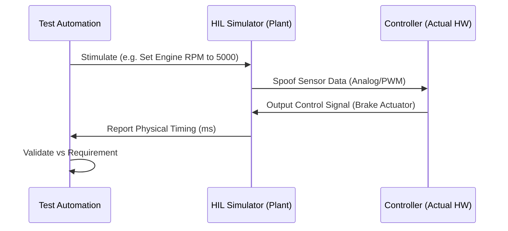

# Hardware-in-the-Loop (HIL)

> "Simulation is for logic. HIL is for physics. You need HIL to ensure that when your code says 'Brake', the motor actually stops before the car hits a wall."

## The Hook: Physics Doesn't Lie
You can have 100% unit test coverage and a perfect simulation, but if your CAN bus has electrical noise, or your battery drops to 3.1V under load, your software will fail in the real world. 

**Hardware-in-the-Loop (HIL)** is the "Zero to One" shift that connects your real firmware, running on a real chip, to a simulated world. It is the final gate between the lab and the customer.

## The Theory: The "Iron Bird" Mindset
In the aerospace world, they build an **Iron Bird.** This is a physical frame with all the real servos, actuators, and controllers, but no wings. They simulate the air, the wind, and the gravity.

---

## Case Study: Tesla - The "Shadow Mode" (Success)
Tesla's HIL strategy is a "Vertical Progress" masterpiece. They don't just use HIL for final sign-off. They use it as a continuous, fleet-wide feedback loop.

*   **Shadow Mode:** When a Tesla car encounters a "near-miss" or a weird steering intervention in the real world, the data is sent back to HQ. 
*   **The Loop:** This exact scenario is fed into the HIL rigs. The development team modifies the code, verifies the fix on the HIL rig (proving it works against real physics), and pushes the update back to the fleet.
*   **The Lesson:** HIL allows you to "re-live" real-world failures in a controlled lab environment with 100% reproducibility.

---

## The Implementation: Scaling the physical gate

Elite teams move beyond single lab benches to **HIL Farms**. If you ignore the electrical physics, your software-defined asset becomes a brick.

### 1. The HIL Farm Architecture
Scaling verification Requires treating physical hardware as a cloud resource:
*   **Centralized Racks:** Racks of target controllers (actual chips) connected to shared, programmable simulators (Plant models).
*   **PR-Driven Hardware Gates:** Every pull request triggers an automated suite on the HIL Farm. A software change that unintentionally increases peak current or violates timing is caught before it enters the main trunk.

### 2. Physical Failure Simulation
The HIL rig must automate the verification of marginal electrical conditions:
*   **Brownout Resilience:** Simulate voltage drops to the exact threshold where memory corruption occurs (e.g., 2.7V). Verify the system enters a safe state and recovers without data loss.
*   **Battery Aging (IR) Emulation:** Advanced HIL rigs simulate the increase in **Internal Resistance (IR)** as a battery ages over 5 years. This verifies that your firmware remains stable during the voltage dips caused by high-current pulses in an aging physical system.
*   **Fault Injection:** Corrupt physical frames on the CAN or I2C bus. Software handlers must be hardened to detect and recover from electrical transients.

### 3. Proemion's Manufacturing Staged Verification
Companies like **Proemion** integrate these HIL patterns into the production lifecycle. Every device produced undergoes 100% automated verification on specialized production testers to ensure silicon integrity and cryptographically signed firmware authentication before delivery.

---

## References & Further Reading
*   [Tesla: The Software-Defined Vehicle Architecture](https://www.tesla.com)
*   [Proemion: Integrated Security and Quality Assurance](https://proemion.com)
*   [NI: Scaling HIL for Automotive and Aerospace](https://www.ni.com)
*   [Antmicro: Building Open Source HIL Rigs with Renode](https://antmicro.com)
