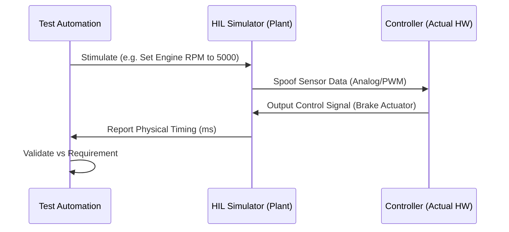

# Hardware-in-the-Loop (HIL)

> "Simulation is for logic. HIL is for physics. You need HIL to ensure that when your code says 'Brake', the motor actually stops before the car hits a wall."

## The Hook: Physics Doesn't Lie
You can have 100% unit test coverage and a perfect simulation, but if your CAN bus has electrical noise, or your battery drops to 3.1V under load, your software will fail in the real world. 

**Hardware-in-the-Loop (HIL)** is the "Zero to One" shift that connects your real firmware, running on a real chip, to a simulated world. It is the final gate between the lab and the customer.

## The Theory: The "Iron Bird" Mindset
In the aerospace world, they build an **Iron Bird**—a physical frame with all the real servos, actuators, and controllers, but no wings. They simulate the air, the wind, and the gravity.

---

## Case Study: Tesla - The "Shadow Mode" (Success)
Tesla's HIL strategy is a "Vertical Progress" masterpiece. They don't just use HIL for final sign-off; they use it as a continuous, fleet-wide feedback loop.

*   **Shadow Mode:** When a Tesla car encounters a "near-miss" or a weird steering intervention in the real world, the data is sent back to HQ. 
*   **The Loop:** This exact scenario is fed into the HIL rigs. The development team modifies the code, verifies the fix on the HIL rig (proving it works against real physics), and pushes the update back to the fleet.
*   **The Lesson:** HIL allows you to "re-live" real-world failures in a controlled lab environment with 100% reproducibility.

---

## The Implementation: The "Stability" Gate
If you want an Elite HIL rig, you must automate the most common source of firmware failure: **Power Events**.

### 1. Automated Power Cycling
Your HIL rig should include a programmable power supply (e.g., *Rigol* or *Siglent*) that can simulate:
*   **Brownouts:** Dropping voltage to 2.8V and seeing if the NVRAM corrupts.
*   **Spikes:** Introducing noise to see if the watchdog triggers.
*   **Hard Reboots:** Power cycling 1,000 times in a row to ensure the bootloader never hangs.
*   **Battery Aging Emulation:** In the 2027-2028 window, HIL rigs move beyond "static" power and simulate the **Internal Resistance (IR)** changes of a battery over 5 years of use. This verifies that your firmware remains stable as the physical power source degrades.

### 2. Proemion's Manufacturing Staging
Companies like **Proemion** take this further by integrating "Manufacturing Staging" into their lifecycle. Every device produced undergoes 100% automated testing on specialized hardware farms to verify silicon integrity and firmware authentication before shipping to the customer.

## References & Further Reading
*   [Tesla: The Software-Defined Vehicle Architecture](https://www.tesla.com)
*   [Proemion: Integrated Security and Quality Assurance](https://proemion.com)
*   [NI: Scaling HIL for Automotive and Aerospace](https://www.ni.com)
*   [Antmicro: Building Open Source HIL Rigs with Renode](https://antmicro.com)
